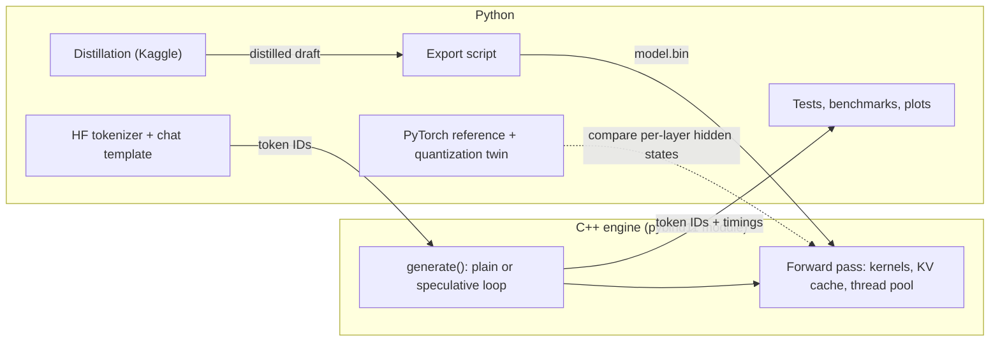

# Project Plan: Speculative Decoding on a Laptop CPU, from Scratch

Build a C++ inference engine for Qwen3, add speculative decoding to it, and distill a draft model that matches it.
All timing happens on a laptop CPU (Intel i7-13620H). Kaggle is used for training and for the PyTorch runs that
don't fit on the laptop.

This version replaces the earlier plan, which targeted a T4 GPU; it is still in the git history. Expect
**10–14 weeks of part-time work**. **Milestones 3 and 4 are natural stopping points** that are resume-worthy on
their own. Section 17 tracks decisions and open questions.

## Status

| Date | Where things stand |
|---|---|
| 2026-10-01 | **Milestone 5 built, and the evaluation harness with it.** Distillation exists end to end: five losses with a chunked form that keeps a 151,669-token vocabulary in memory, a trainable draft that reuses the verified reference forward pass, the training loop (teacher as a callable, so the full-precision target, the 4-bit twin or cached logits all fit), the data pipeline with 13-gram decontamination, and runnable scripts for both. An integration test trains a miniature Qwen3 carrying the real tokenizer, saves it, exports it and runs it in the engine. Spec-Bench harness runs target-alone, the draft, prompt lookup and early stopping, interleaved, into a per-category table. Layer pruning scores and cuts layers; see §11.7 for what that measured. 620 tests pass. Remaining before results: the 4B target, then the grid. |
| 2026-10-01 | **Milestone 4 core done.** The k-token kernel shares one pass over the weights across the tokens being verified, and is bit-identical to calling the single-token kernel once per token (tested for 1–13 tokens, across tile boundaries). The forward pass is now batched to match. The decoding loops moved into C++ — sampling warps, a seeded xoshiro generator, the acceptance rule and the round loop — so Python overhead never lands in a timing. Greedy output from the C++ loop matches both plain decoding and the Python loop token for token; its sampling passes the same chi-square over every two-token continuation. First v(k) numbers for the 0.6B at context 128: v(2) ≈ 2.1 falling to v(5) ≈ 3.1, i.e. per-token cost inside a pass drops from 19.5 ms to about 11.5 ms. **Verification is not nearly free for a 0.6B**, because its weights are small next to its arithmetic; the 4B is where the term should flatten, and that needs the 4B downloaded. 507 tests pass. |
| 2026-10-01 | **Milestone 3 under way.** Persistent thread pool with spin barriers, row-split work, core pinning and CPU topology detection; attention, the norms and the KV cache writes vectorized. Decode went from 4.4 tok/s (scalar, single thread) to a median of about 30–50 tok/s on six performance cores at context 128, against a measured ceiling of 100–117 tok/s. Measured read bandwidth 37–39 GB/s (about 75% of the DDR4-3200 theoretical 51.2). Dispatch overhead is 0.9 µs per parallel job, so barriers are not the constraint. See §13 for why the range on the decode figure is so wide. 454 tests pass. Next: the k-token kernel, which sets v(k). |
| 2026-09-30 | **Milestone 1 done.** Qwen3 written from scratch matches Hugging Face layer by layer and token for token. The quantization formats exist in C++, NumPy and torch, byte-identical. The 0.6B exports to 4 bits at 4.50 bits/weight (335 MB). Perplexity table measured (§7.2). **Milestone 2 done.** The C++ engine loads that file, its fp32 path matches the reference to 1e-5, and its greedy output matches the twin token for token; the Python speculative decoder drives it. Toolchain installed (VS Build Tools 2026, MSVC 19.51, clang-cl 22.1, CMake 4.3, Ninja 1.13). 434 tests pass. Next: Milestone 3, making it fast. |

---

## Contents

0. [TL;DR](#0-tldr)
1. [Goal, deliverables, success criteria](#1-goal-deliverables-success-criteria)
2. [How the pieces fit](#2-how-the-pieces-fit)
3. [The speedup model](#3-the-speedup-model)
4. [Additions to the idea](#4-additions-to-the-idea)
5. [Setup](#5-setup)
6. [Milestone 0: Feasibility](#6-milestone-0-feasibility)
7. [Milestone 1: PyTorch reference and quantization](#7-milestone-1-pytorch-reference-and-quantization)
8. [Milestone 2: A correct C++ engine](#8-milestone-2-a-correct-c-engine)
9. [Milestone 3: A fast engine](#9-milestone-3-a-fast-engine)
10. [Milestone 4: Speculative decoding in the engine](#10-milestone-4-speculative-decoding-in-the-engine)
11. [Milestone 5: Distillation on Kaggle](#11-milestone-5-distillation-on-kaggle)
12. [Milestone 6: Write-up and release](#12-milestone-6-write-up-and-release)
13. [Benchmarking rules](#13-benchmarking-rules)
14. [Timeline](#14-timeline)
15. [Risks and mitigations](#15-risks-and-mitigations)
16. [Related work and references](#16-related-work-and-references)
17. [Decisions and open questions](#17-decisions-and-open-questions)

---

## 0. TL;DR

- **What you build**
  - *C++ engine:* weight loading, the forward pass, 4-bit and 8-bit SIMD kernels, a thread pool that knows about
    the CPU's two core types, KV cache, sampling, and the speculative decoding loop.
  - *Python side:* a Qwen3 reference written from scratch, a quantization "twin" that reproduces the engine's
    arithmetic, an export script, distillation (on Kaggle), and all testing and benchmarking.
  - *Bridge:* pybind11. Python tokenizes and passes token IDs in. The whole generation loop runs in C++, so Python
    overhead never touches the timings.
- **The formula you're testing.** On a CPU, checking k tokens costs more than one normal step, so the formula gets
  a measured verification term v(k):

  speedup(γ) = τ(γ) ÷ (γ·c + v(γ+1)), where τ(γ) = (1 − α^(γ+1)) / (1 − α)

- **Headline results you'll end up with**
  - tokens per second for both models as a percentage of the laptop's memory-bandwidth ceiling, next to llama.cpp;
  - the v(k) curve;
  - predicted versus measured speedup across γ;
  - a comparison of core and thread configurations;
  - the speedup from distilled drafts on each Spec-Bench category.
- **Main additions to the idea** (§4)
  1. A quantization twin that also quantizes activations and the KV cache, so PyTorch predicts what the engine
     computes.
  2. The offline round simulator, so acceptance for every configuration is computed on Kaggle instead of by slow
     decoding on the CPU.
  3. One k-token kernel used for normal decoding, verification and prompt processing, which makes greedy
     equivalence bit-exact by construction.
  4. c measured as a function of context length, because the draft's KV cache is nearly as large as the target's.
  5. The draft's precision (4-bit vs 8-bit) treated as a trade-off between c and α.
  6. The distillation track run in parallel with the engine work.

---

## 1. Goal, deliverables, success criteria

**Headline question:** How close can a from-scratch CPU engine get to the laptop's memory-bandwidth ceiling, and
how much faster can speculative decoding with a distilled draft make Qwen3-4B on it? Checking γ+1 tokens isn't
free on a CPU, so part of the answer is how much each extra guess costs.

**Deliverables**

- A C++ engine with Python bindings. It builds with `pip install -e .` on Windows and has tests at every layer.
- A PyTorch Qwen3 reference, a quantization twin and an export script.
- Distilled drafts on the Hugging Face Hub, in safetensors, in the engine's format and as GGUF.
- A README and write-up that open with tokens per second, the percentage of the bandwidth ceiling, and the
  speedup, and that include a "what didn't work" section.

**Success criteria** (replace the placeholders after Milestone 0)

- **Correct**
  - The reference model matches Hugging Face within float32 rounding.
  - The engine's greedy output matches the PyTorch model token for token.
  - Speculative greedy output matches plain greedy **bit for bit**.
  - The sampling tests pass.
- **Fast**
  - Engine generation speed is at least X% of the measured bandwidth ceiling for both models.
  - The gap to llama.cpp at the same quantization and thread count is explained.
- **Explained:** predicted speedup is within about 10% of measured speedup across γ, or the gap is explained.
- **Better:** the distilled draft beats the off-the-shelf draft on tokens per round and end-to-end speedup,
  averaged over Spec-Bench categories.

---

## 2. How the pieces fit



- **Development model:** do all development on **Qwen3-0.6B**, and bring in the 4B once quantization works.
- **Why the 4B needs special handling:** it takes 16 GB in float32, which the laptop (16 GB of RAM) can't hold. Run
  its PyTorch reference in bfloat16 locally, or in fp32 on Kaggle.

**Proposed repo layout**

```
draft-model/
├── PLAN.md
├── README.md
├── pyproject.toml            # scikit-build-core: `pip install -e .` builds the C++ extension
├── CMakeLists.txt
├── engine/
│   ├── src/
│   │   ├── model_file.cpp    # memory-mapped weights file + tensor directory
│   │   ├── forward.cpp       # layers, attention, KV cache, forward(tokens[k], pos)
│   │   ├── kernels/          # scalar reference, AVX2 + AVX-VNNI; Q8/Q4, k-token versions
│   │   ├── threadpool.cpp    # persistent threads, spin barriers, core pinning
│   │   ├── sampling.cpp      # warps, softmax, accept_or_resample
│   │   └── speculative.cpp   # round loop
│   ├── bindings.cpp          # pybind11 module
│   └── tests/                # C++ unit tests (SIMD kernels vs scalar reference)
├── python/specdraft/
│   ├── reference.py          # Qwen3 from scratch
│   ├── quant.py              # the engine's number formats, bit for bit
│   ├── twin.py               # reference + weight/activation/KV quantization
│   ├── export.py             # fuse QKV and gate/up, quantize, write model.bin
│   ├── sampling.py           # Python accept_or_resample (test oracle)
│   ├── offline.py            # 1 − TVD, top-1 match, round simulator
│   ├── data.py, losses.py, train.py   # distillation
│   └── bench.py              # benchmark harness for the engine and llama.cpp
├── tests/                    # pytest: reference vs HF, engine vs twin, sampling
├── notebooks/                # Kaggle
├── configs/
└── results/                  # JSON records, plots, milestone notes
```

---

## 3. The speedup model

Speculative decoding, briefly: the draft guesses γ tokens, the target checks all of them in one pass, and each
guess is accepted with probability min(1, p/q). At the first rejection, a replacement is sampled from
max(0, p − q), renormalized. If every guess is accepted, the target adds one bonus token. The output follows the
target's distribution exactly.

$$\text{speedup}(\gamma) = \frac{\tau(\gamma)}{\gamma c + v(\gamma+1) + o}, \qquad \tau(\gamma) = \frac{1-\alpha^{\gamma+1}}{1-\alpha}$$

- **α:** per-token acceptance. For sampling it is 1 − TVD(p, q); for greedy it is the top-1 match rate.
- **c:** time for one draft step ÷ time for one target step.
- **v(k):** time for the target to process k tokens in one pass ÷ time for one normal target step. The original
  formula assumes v = 1.
- **o:** per-round overhead ÷ one target step. On a CPU the main part is **sampling**: each round needs about 2γ+1
  softmaxes over 151,669 entries, which can be a few percent of a target step. Measure o, and parallelize the
  softmax if it matters.

**Why v(k) > 1 on a CPU.**

- A single-token step is memory-bound: it streams all the weights once and does little math per byte.
- With k tokens, each weight block is unpacked once and multiplied into k activation vectors. Bytes stay the same,
  but integer math grows with k.
- Once the math takes longer than streaming the weights, v(k) climbs roughly linearly.
- **The better your k-token kernel, the flatter v(k), the larger the best γ, and the bigger the speedup.** Kernel
  quality turns directly into speculative speedup.

**Example with made-up numbers (α = 0.7, c = 0.15):**

- *Four guesses per round:* if v(5) = 1.5, the speedup is 1.32×.
- *Two guesses per round:* if v(3) = 1.2, the speedup is 1.46×.

As checking more tokens gets more expensive, the best γ drops.

**Best-γ speedup with a linear model v(k) = 1 + s·(k − 1)** (o = 0; best γ in parentheses):

| c | α | s = 0 (the original formula) | s = 0.05 | s = 0.10 | s = 0.20 |
|---|---|---|---|---|---|
| 0.15 | 0.6 | 1.51× (2) | 1.40× (2) | 1.31× (2) | 1.19× (1) |
| 0.15 | 0.7 | 1.75× (3) | 1.58× (3) | 1.46× (2) | 1.29× (2) |
| 0.15 | 0.8 | 2.11× (5) | 1.87× (4) | 1.69× (3) | 1.44× (3) |
| 0.22 | 0.7 | 1.53× (3) | 1.42× (2) | 1.34× (2) | 1.20× (1) |
| 0.22 | 0.8 | 1.79× (4) | 1.63× (3) | 1.51× (3) | 1.33× (2) |
| 0.30 | 0.7 | 1.37× (2) | 1.29× (2) | 1.22× (2) | 1.13× (1) |
| 0.30 | 0.8 | 1.55× (3) | 1.44× (3) | 1.36× (2) | 1.22× (2) |

Realistic targets on this laptop are about 1.3–1.7× with the off-the-shelf draft, and closer to 2× only if
distillation pushes α toward 0.8 *and* the k-token kernel keeps s small. The table is the prediction the
measurements get checked against.

> **Measured, 2026-10-01: the real slope is 0.48, nearly two and a half times the most pessimistic row above —
> and that, not the draft, is what caps the speedup.** On Qwen3-4B at 4 bits, six performance cores,
> context 128: a single target step is 70.6 ms and a k-token pass costs **32 ms + 34 ms per token**
> (fitted over k = 2…6, residuals within 8 ms), so v(k) ≈ 0.46 + 0.48k.
>
> The two terms are worth separating carefully, because the obvious reading is wrong. Streaming the 2.26 GB
> of 4-bit weights at the measured 39.5 GB/s takes **57 ms**, not 32 — so the intercept is not the memory
> traffic. It is the part of that traffic which fails to hide behind the arithmetic; about 25 ms of
> streaming does overlap, and the rest does not. The 34 ms slope is the integer arithmetic per token, which
> k tokens cannot share. Comparing the measurement against a perfectly overlapped `max(memory, compute)`
> makes the gap plain: that model predicts 57, 68, 102, 135, 169, 203 ms for k = 1…6 where the engine takes
> 71, 103, 136, 160, 199, 240. Every pass runs about 35 ms over the ideal, which is roughly one token's
> worth of compute that never overlaps with anything.
>
> So the arithmetic, not the bandwidth, is what k tokens fail to amortize. On a GPU the same ratio is
> perhaps a hundredth, which is why v ≈ 1 there and the original formula omits the term.
>
> With c = 0.220 and o = 0.080 measured alongside it, the predicted speedup is:
>
> | α | γ=1 | γ=2 | γ=3 | γ=4 | γ=5 | best |
> |---|---|---|---|---|---|---|
> | 0.70 | 0.97 | 0.90 | 0.84 | 0.73 | 0.64 | 0.97× (γ=1) |
> | 0.80 | 1.03 | 1.00 | 0.98 | 0.89 | 0.80 | 1.03× (γ=1) |
> | 0.90 | 1.09 | 1.11 | 1.14 | 1.08 | 1.02 | 1.14× (γ=3) |
> | 1.00 | 1.14 | 1.23 | **1.33** | 1.32 | 1.31 | 1.33× (γ=3) |
>
> The last row is the one that matters: **α = 1 is a draft that is never wrong, and it still only reaches
> 1.33×.** No amount of distillation can beat that line, because it is set by v(k) alone. So the
> "realistic 1.3–1.7×" above was wrong about where the difficulty lies. Acceptance is not the binding
> constraint on this machine; the kernel's arithmetic is.
>
> But 1.33× is the ceiling **of this kernel**, not of this laptop, and the difference is the whole point.
> The kernel sustains about 114 GMAC/s across six cores, roughly 8% of what AVX-VNNI can issue at this
> clock, so the inner loop is limited by the work *around* `dpbusd` — unpacking nibbles, the sign trick,
> the per-block scale broadcast — not by the multiply-accumulate. Ask instead what the *bandwidth* permits:
> if the arithmetic were free, a k-token pass would cost only the 57 ms of streaming, giving v(k) ≈ 0.81
> flat for every k. With that floor and a 4-bit draft at c ≈ 0.15:
>
> | α | best speedup at the bandwidth floor | measured today |
> |---|---|---|
> | 0.70 | 1.89× (γ=3) | 0.97× |
> | 0.80 | 2.25× (γ=4) | 1.03× |
> | 0.90 | 2.93× (γ=7) | 1.14× |
>
> **The gap between those two columns is entirely the kernel's arithmetic efficiency.** That reframes the
> project: the interesting quantity is not whether speculation pays on a CPU, but how much of the
> bandwidth-floor speedup a good k-token kernel can recover. See §10.1 for the three changes that chase it.
>
> Two caveats on the numbers above. Beyond k = 6 the measured curve jumps (+129 ms at k = 7, against
> +42 ms at k = 6) because eight per-token accumulators plus the unpack temporaries stop fitting in
> registers; the fit is taken over k ≤ 6, and the useful γ range sits inside it. And the tile constant is
> currently 8, so a tile of 6 would be the better choice — it would keep k = 7…12 at two cheap passes
> instead of one spilling pass plus one cheap one.

**Back-of-envelope for this laptop.** The bandwidth figure is an assumption until Milestone 0 measures it.

| | Qwen3-0.6B | Qwen3-4B |
|---|---|---|
| Layers / hidden / head_dim / query heads : KV heads | 28 / 1024 / 128 / 16 : 8 | 36 / 2560 / 128 / 32 : 8 |
| Weights read per token, 4-bit (4.5 bits/weight incl. scales) | ~0.34 GB | ~2.26 GB |
| Weights read per token, 8-bit (8.5 bits/weight) | ~0.63 GB | ~4.27 GB |
| fp16 KV cache per token of context | ~115 KB | ~147 KB |
| KV cache read per step at 2k context | ~0.23 GB | ~0.30 GB |
| Speed ceiling at 40 GB/s, 4-bit, 256-token context | ~110 tok/s | ~17 tok/s |

**c grows with context length.** The draft has almost as much KV cache per token as the target (28 × 8 × 128
against 36 × 8 × 128), but only about a seventh of the weight bytes. With 4-bit weights for both models, the
bandwidth-bound c is:

| Context | 256 | 1k | 2k |
|---|---|---|---|
| c, draft 4-bit / target 4-bit | ~0.16 | ~0.19 | ~0.22 |
| c, draft 8-bit / target 4-bit | ~0.29 | ~0.31 | ~0.34 |

A float32 KV cache would make this worse: at 2k context the draft's KV bytes would exceed its 4-bit weights. So
the KV cache is stored in fp16, and 8-bit KV for the draft is a stretch goal.

---

## 4. Additions to the idea

| Addition | Why |
|---|---|
| A **quantization twin**: fake-quantize activations (8-bit blocks at every matmul input) and round the KV cache to fp16, not just the weights | The engine quantizes activations too. With the twin, PyTorch logits track the engine closely, perplexity numbers describe what the engine actually runs, and acceptance measured on Kaggle transfers to the engine. |
| **An offline round simulator** (§11.6), run on the twin | Online decoding on the laptop runs at about 15–30 tok/s, so a full Spec-Bench pass per configuration would take hours. Offline, acceptance for every draft × decoding mode × γ × category takes minutes on Kaggle. The engine confirms a subset and does all the timing. |
| **One templated k-token kernel** for single tokens, verification and prompt processing | Same code, same summation order, so greedy speculative decoding is bit-exact by construction. Prompt processing comes for free. |
| **c measured against context length**; 8-bit draft KV as a stretch goal | The draft's KV cache is nearly as large as the target's (§3). |
| **Draft precision as a trade-off** (4-bit vs 8-bit; 8-bit output layer) | Going from 4-bit to 8-bit roughly doubles c (0.16 → 0.29), but a 4-bit 0.6B may lose acceptance. Measure both. |
| **Thread configuration per phase** | Draft steps are limited by thread synchronization, target steps by bandwidth, and verification by compute. The best cores and thread counts may differ for each. |
| **A read-only bandwidth test** next to STREAM | Inference only *reads* weights. STREAM's copy and triad kernels include writes and understate the ceiling. |
| **Q4_0 and Q8_0 in llama.cpp** | The engine uses the same block layouts, so the comparison is like for like. K-quants would not be. |
| **The offset trick** as an alternative to the sign trick | w·x = q·x − 8·Σx with precomputed activation block sums skips the abs/sign work in every block. Try both. |
| **Sampling overhead o** in the formula | Softmax over a 152k vocabulary for about 2γ+1 positions per round isn't free on a CPU. |
| **The distillation track runs in parallel** | It only depends on Milestone 1's twin, so Kaggle jobs can start around week 3 while the engine is being written. |
| **Tiny random models** exported to the engine format | Enable exact-enumeration sampling tests and a fast CI. |
| **Toolchain setup in Milestone 0** | No compiler, CMake or Ninja is installed yet (checked 2026-09-21). |

---

## 5. Setup

### 5.1 Hardware (checked 2026-09-21)

- **CPU:** Intel Core i7-13620H (Raptor Lake).
  - 6 performance cores with hyperthreading plus 4 efficiency cores: 10 cores, 16 threads.
  - Supports AVX2, FMA, F16C and **AVX-VNNI**, but **not AVX-512**. 24 MB L3 cache.
- **Memory:** 16 GB DDR4-3200 as two 8 GB modules (dual channel).
  - **51.2 GB/s theoretical.** Expect about 35–45 GB/s of measured read bandwidth.
- **No NVIDIA GPU.** Kaggle (2×T4) handles training, full-size PyTorch runs of the 4B, and offline evaluation.
- **RAM limits:**
  - 4B in fp32 (16 GB): doesn't fit.
  - 4B in bfloat16 (8 GB): fits for short forward passes with other programs closed.
  - The engine's 4-bit models (2.3 GB + 0.34 GB): fit easily.

### 5.2 Toolchain

- **Visual Studio Build Tools** (2022 or newer), with the "Desktop development with C++" workload plus "C++ Clang
  tools for Windows". This provides MSVC, clang-cl, CMake and Ninja.
- **Build natively, not in WSL.** The experiments with the two core types need real control over which cores
  threads run on (`GetSystemCpuSetInformation`, `SetThreadAffinityMask`, `SetThreadSelectedCpuSets`).
- **Compiler flags**
  - MSVC: `/O2 /arch:AVX2`. clang-cl: `-O2 -mavx2 -mfma -mf16c -mavxvnni`.
  - **Never use `/fp:fast` or `-ffast-math`.** Reordered floating-point math breaks bit-exactness.
  - Check for AVX-VNNI at runtime with CPUID and fall back to the scalar kernel.
- **MSVC quirks:** there is no `std::aligned_alloc`, so use `_aligned_malloc`/`_aligned_free` (or rely on the
  memory-mapped file's alignment). MSVC's OpenMP is old, which is one more reason for a custom thread pool.
- **Python:** a venv with `torch` (CPU build), `transformers`, `tokenizers`, `safetensors`, `numpy`, `scipy`,
  `pytest`, `pybind11`, `scikit-build-core` and `datasets`. Python 3.14 is installed. If any wheel is missing for
  it, use a 3.12 or 3.13 venv.
- **Profiling:** Intel VTune (free) for hotspots and memory bandwidth, plus the engine's own per-operation timers.
- **llama.cpp:** use a prebuilt Windows CPU release or build it. Convert with `convert_hf_to_gguf.py` and quantize
  to Q4_0 and Q8_0 with `llama-quantize`.

### 5.3 Models

- **Draft:** `Qwen/Qwen3-0.6B`. **Target:** `Qwen/Qwen3-4B`. Both are Apache-2.0, share a tokenizer, and run in
  non-thinking mode.
- **Why Qwen3:** it is pure attention, so rolling back rejected guesses just means moving a position counter.
  Architectures with linear-attention or recurrent layers can't be rolled back that way.
- **Variant to consider:** `Qwen3-4B-Instruct-2507`, a stronger target with no thinking mode. There's no matching
  0.6B, so distillation has more to fix. Check that its tokenizer and chat template are compatible first (§17).

### 5.4 Checklist of things that break from-scratch Qwen3s

- [ ] **`head_dim` = 128 comes from the config.** It isn't hidden ÷ heads, which would give 64 for the 0.6B and 80
      for the 4B.
- [ ] **Queries and keys each get their own RMSNorm**, applied per head (the weight has shape `[head_dim]`)
      **before RoPE**.
- [ ] **RoPE rotates the two halves of each head** (element i pairs with i + 64), not adjacent pairs.
      `rope_theta` = 1,000,000.
- [ ] **RMSNorm:** eps 1e-6, computed in fp32, with a plain weight multiply (not Gemma's 1 + w).
- [ ] **Attention:** no biases; scale 1/√128; grouped-query attention with 2 query heads per KV head (0.6B) or 4
      (4B).
- [ ] **MLP:** `down(silu(gate(x)) * up(x))`.
- [ ] **Tied embeddings:** both models reuse the embedding matrix as the output layer
      (`tie_word_embeddings: true`).
- [ ] **Vocabulary padding:** there are 151,936 embedding rows but only about 151,669 tokenizer entries. Never
      sample from, or compute, rows past `len(tokenizer)`.
- [ ] **Thinking mode:** build every prompt in Python with `apply_chat_template(..., enable_thinking=False)` and
      pass the same token IDs to the engine and to llama.cpp.
- [ ] **End-of-sequence:** stop on `<|im_end|>` (151645) and `<|endoftext|>` (151643).
- [ ] **Sampling warps:** p is the *warped* target distribution and q is *exactly* the distribution the draft
      sampled from.

---

## 6. Milestone 0: Feasibility

*Estimated time: an evening or two, plus toolchain setup.*

1. **Toolchain.** Install everything in §5.2, then build a hello-world pybind11 module through scikit-build-core to
   prove the build pipeline works.
2. **Memory bandwidth.**
   - Build STREAM (with `/openmp` or `-fopenmp`, arrays far larger than the L3 cache).
   - Also write a **read-only** multi-threaded reduction benchmark.
   - Run both at 6, 10 and 16 threads. The best read bandwidth is **your speed ceiling for the rest of the
     project.**
3. **llama.cpp baseline.**
   - Convert both models to GGUF and quantize them to **Q4_0** and **Q8_0**.
   - Use `llama-bench` to get generation and prompt-processing speed at 6, 10 and 16 threads.
   - Run speculative decoding (4-bit target, 4-bit and 8-bit draft) at draft lengths 1–8, greedy, on about 20
     chat-template prompts. Record the speedup over the 4B alone. Flag names change between versions, so check
     `--help`.
4. **Ceiling check.** Compute llama.cpp's generation speed as a percentage of the ceiling: tok/s × bytes per
   token ÷ bandwidth.
5. **Write it up** in `results/m0.md`.

**Decision gates**

| Observation | Action |
|---|---|
| llama.cpp speculative decoding is clearly faster (≥ 1.2×) | Proceed as planned. |
| Roughly break-even | Proceed, but lean on a cheaper draft (4-bit, trimmed vocabulary) and a flatter v(k). Beating llama.cpp's break-even would itself be a result. |
| Slower at every draft length | The headline would become explaining why, which is weaker. Choose between continuing, splitting into two projects (the engine, and the GPU distillation plan in git history), or picking one. |
| Measured bandwidth well below ~35 GB/s | Check the power mode and that both memory channels are in use before going further, because the ceiling sets every other number. |

---

## 7. Milestone 1: PyTorch reference and quantization

*Estimated time: 1–2 weeks.*

### 7.1 Reference model

- **What to build:** Qwen3 from scratch (embedding, RMSNorm, grouped-query attention with the q/k norms and RoPE,
  SwiGLU MLP, tied output layer). Load the safetensors weights directly. This takes about 200 lines.
- **Mirror the engine's interface:** give it `forward(tokens[k], pos)` with an explicit KV cache, so it can serve
  as the oracle for normal decoding, verification and prompt processing later.
- **Done when:** logits match Hugging Face's `Qwen3ForCausalLM` in fp32 within float32 rounding (max absolute
  logit difference around 1e-3 or better), and a greedy continuation of more than 100 tokens is identical.
- **Where to run it:** the 0.6B in fp32 on the laptop. The 4B in bfloat16 on the laptop, or in fp32 on Kaggle
  (split across both T4s, or on Kaggle's CPU).

### 7.2 Quantization that reproduces the engine exactly

**Formats** (the same block layouts as ggml's Q8_0 and Q4_0):

| Format | Layout | Size |
|---|---|---|
| 8-bit weights | 32 × int8 plus an fp16 scale | 34 bytes, 8.5 bits/weight |
| 4-bit weights | 16 bytes of nibbles plus an fp16 scale; low nibbles are weights 0–15, high nibbles are weights 16–31; value = (q − 8)·d | 18 bytes, 4.5 bits/weight |
| 8-bit activations | 32 × int8 in [−127, 127] plus an fp32 scale (and optionally the block sum, for the offset trick) | quantized once per matmul input |

**Pin down the exact rounding rules and use them in both Python and C++.**

- *8-bit:* d = max|w|/127, q = round(w/d) with halves rounded away from zero.
- *4-bit:* following ggml's Q4_0, d = (the value with the largest magnitude, sign kept) / −8, then
  q = clamp(floor(w/d + 8.5), 0, 15).
- *Scales:* always dequantize with the **fp16-rounded** scale, exactly as the engine does.
- *Test:* the C++ and Python quantizers must produce **identical bytes** on random tensors.

**The twin** is the reference model plus three changes:

1. weights fake-quantized;
2. activations fake-quantized to 8-bit blocks at every matmul input;
3. the KV cache rounded to fp16.

Run in fp32, the twin matches the engine except for floating-point summation order.

**Perplexity table.** Measure WikiText-2 (test split, 2048-token windows) for both models in five
configurations: fp32, 8-bit, 4-bit, 4-bit with an 8-bit output layer, and the full twin. Run the 4B on Kaggle.
Expect the 0.6B to lose more at 4-bit. That result feeds the choice of draft precision.

### 7.3 Export script

- **Fuse matrices:** Q, K and V into one `[q_dim + 2·kv_dim, hidden]` matrix, and gate and up into one
  `[2·intermediate, hidden]` matrix. Fewer matrices means fewer points where threads wait on each other.
  - *Option:* interleave gate and up rows in blocks, so each thread can apply silu(gate)·up to its own rows before
    the barrier.
- **Tied embedding:** store it once, and use it both for the embedding lookup (dequantize one row) and as the
  output layer.
- **Formats per tensor:** norm weights in fp32. Each matrix gets its own format, which allows mixes such as a
  4-bit body with an 8-bit output layer. Also export an **all-fp32** file for debugging in Milestone 2.
- **File layout:** one binary file. It starts with a header (magic number, version, config, and a tensor
  directory giving each tensor's name, format, shape and offset). The data follows at **64-byte-aligned offsets**.
  C++ memory-maps it (`CreateFileMapping`/`MapViewOfFile`).
- **Test:** reload the file in Python, dequantize it, and compare with the twin's weights (they must be exact).

**Done when:** the reference matches Hugging Face, the perplexity table exists, and export round-trips byte for
byte.

---

## 8. Milestone 2: A correct C++ engine

*Estimated time: 2–3 weeks.*

- **Build setup:** CMake and pybind11, built through scikit-build-core, so `pip install -e .` rebuilds the
  extension.
- **Forward pass, correctness first**
  - Start with **plain float32 loops**: no SIMD, no threads, and the all-fp32 weights file.
  - Then add **scalar** 8-bit and 4-bit kernels (below) before any SIMD.
  - Use a KV cache per layer laid out as `[kv_head][position][head_dim]`, with a position counter.
  - Write `forward(tokens[k], pos)` for **k tokens from day one** (k = 1 for normal decoding). Verification and
    prompt processing need it later.
- **Sampling:** greedy, temperature, top-k and top-p. Use a seeded RNG (e.g., PCG) whose seed is set from Python,
  for reproducibility.
- **Debug hooks:** a pybind function that returns the hidden states after every layer as numpy arrays.
- **Testing**
  - Compare hidden states layer by layer against the PyTorch reference in fp32. The first layer that diverges is
    where the bug is.
  - Then compare the quantized formats against the twin.
- **Done when:** greedy generation matches PyTorch token for token. The fp32 engine is compared with the fp32
  reference, and the quantized engine with the twin; any mismatches must be documented near-ties.

> **Measured, 2026-09-30: how closely the engine and the twin can agree.** The fp32 path agrees to 1e-5, so the
> arithmetic is right. The quantized path cannot agree elementwise, and tightening the threshold would only
> produce a test that fails for the wrong reason. 8-bit activation quantization is a *step function*: on the real
> 0.6B, nudging one layer's input by 7e-8 relative — far below float32 noise — flips **229 of 1024** activation
> levels and moves that layer's output by 5e-3, and the effect *saturates* rather than shrinking as the nudge gets
> smaller. Two implementations differing by one ulp anywhere therefore diverge by about that much per layer, which
> compounds to a few percent in the logits over 28 layers.
>
> Three consequences, all of them now enforced by tests:
> 1. **What to assert about engine versus twin:** identical decoded tokens, top-1 agreement (measured 98.9%), and
>    a bounded total variation distance (measured 0.023) — never elementwise closeness.
> 2. **Bit-exactness still holds strictly inside the engine.** A k-token pass equals k single-token passes exactly,
>    which is all that greedy speculative decoding needs, and it is unaffected by this.
> 3. **Scoring the engine's own text is worth it (see §11.6).** The engine exposes all logits, so final acceptance
>    numbers need not inherit the twin's 1–2% offset.

**Scalar reference kernel.** This becomes the oracle for the SIMD version.

```cpp
#include <cstdint>

struct BlockQ4 { uint16_t scale; uint8_t q[16]; };  // 32 weights at 4 bits + fp16 scale
struct BlockQ8 { uint16_t scale; int8_t q[32]; };   // 32 weights at 8 bits + fp16 scale
struct BlockA8 { float scale; int8_t q[32]; };      // 32 activations at 8 bits + fp32 scale

// Scalar reference for testing the SIMD kernel. fp16_to_fp32 can use F16C's _cvtsh_ss.
float dot_q4_a8(const BlockQ4* w, const BlockA8* x, int nblocks) {
    float sum = 0.0f;
    for (int b = 0; b < nblocks; ++b) {
        int32_t acc = 0;
        for (int i = 0; i < 16; ++i) {
            int lo = (w[b].q[i] & 0x0F) - 8;   // weight i
            int hi = (w[b].q[i] >> 4) - 8;     // weight i + 16
            acc += lo * x[b].q[i] + hi * x[b].q[i + 16];
        }
        sum += fp16_to_fp32(w[b].scale) * x[b].scale * acc;
    }
    return sum;
}
```

---

## 9. Milestone 3: A fast engine

*Estimated time: 2–3 weeks.*

**Measure before optimizing.** Add per-operation timers and counters of bytes moved, so every operation reports
its percentage of the bandwidth ceiling. Use VTune for hotspots.

These steps are in rough order of payoff.

1. **Thread pool**
   - Keep threads alive between operations and have them **spin-wait** at barriers.
   - Split each matrix-vector product across threads **by output rows**.
   - A 0.6B model hits well over a hundred synchronization points per token, so waking threads through the OS each
     time would eat much of the speedup.
2. **Quantized kernels.** Do 8-bit first, then 4-bit.
   - Quantize each activation vector into 8-bit blocks once per matmul input, so the inner loop is integer
     multiply-adds.
   - For SIMD, use AVX-VNNI's **`_mm256_dpbusd_avx_epi32`**. The `_avx_` in the name matters: the version without
     it requires AVX-512.
   - It multiplies *unsigned* bytes by *signed* bytes, hence one of these tricks:
     - *Sign trick:* take |w| and move w's sign onto x with `_mm256_sign_epi8`.
     - *Offset trick:* use the raw nibbles q ∈ [0, 15] as the unsigned operand, and subtract 8·Σx using block sums
       precomputed when the activations are quantized.

     Benchmark both.
   - Blocks are 18 bytes, so loads are unaligned (`_mm_loadu_si128`). If profiles show loads or shuffles
     dominating, try repacking (scales stored separately from nibbles, or several rows interleaved).
   - Test every SIMD kernel against the scalar reference on random blocks.

   ```cpp
   // Sketch: one 4-bit block times one 8-bit block with AVX2 + AVX-VNNI (sign trick).
   __m128i packed = _mm_loadu_si128((const __m128i*)w.q);            // 32 nibbles
   __m256i nib = _mm256_and_si256(_mm256_set_m128i(_mm_srli_epi16(packed, 4), packed),
                                  _mm256_set1_epi8(0x0F));            // w0..15 | w16..31, as 0..15
   __m256i wq = _mm256_sub_epi8(nib, _mm256_set1_epi8(8));            // signed weights in [-8, 7]
   __m256i xq = _mm256_loadu_si256((const __m256i*)x.q);
   __m256i acc = _mm256_dpbusd_avx_epi32(_mm256_setzero_si256(),
                                         _mm256_sign_epi8(wq, wq),   // |w|, unsigned
                                         _mm256_sign_epi8(xq, wq));  // x with w's sign
   sum = _mm256_fmadd_ps(_mm256_set1_ps(fp16_to_fp32(w.scale) * x.scale),
                         _mm256_cvtepi32_ps(acc), sum);              // 8 float lanes per row
   ```

3. **KV cache and attention**
   - Store the KV cache in **fp16**, which F16C converts cheaply.
   - Process **all query heads that share a KV head together**, so each K/V row is read from memory once.
   - For the 0.6B draft at 2k context, a float32 KV cache would add more bytes per token than the 4-bit weights.
4. **Using both core types.** Compare four setups:
   - the 6 performance cores alone;
   - all 10 cores with the rows split evenly;
   - all 10 cores with **dynamic chunks**, where threads grab the next block of rows from an atomic counter so the
     fast cores do more;
   - 16 threads with hyperthreading.

   Then check whether the best setup differs between **draft steps** (small matrices, dominated by
   synchronization), **target steps** (bandwidth-bound) and **verification** (compute-bound). If it does, the
   engine should use a different configuration for each.

   On Windows, `GetSystemCpuSetInformation` reports each logical processor's `EfficiencyClass`. Pin threads with
   `SetThreadAffinityMask` (hard) or `SetThreadSelectedCpuSets` (soft).
5. **Optional polish:** fuse RMSNorm with activation quantization; fuse silu·up into the gate/up kernel; parallelize
   the softmax; add prefetching; try large pages; parallelize attention across positions at long contexts.

**Done when** you have a table of tokens per second for both models at 256, 1k and 2k context, in 8-bit and 4-bit,
where each result is:

- shown as a percentage of the bandwidth ceiling;
- next to llama.cpp at the same quantization and thread count;
- accompanied by an explanation of the remaining gap from the per-operation breakdown.

**This is stopping point A:** a fast, tested CPU inference engine.

---

## 10. Milestone 4: Speculative decoding in the engine

*Estimated time: 1–2 weeks.*

### 10.1 The k-token kernel

- Unpack each weight block once and reuse it for all k activation vectors. This kernel is what sets v(k).
- **Use one kernel, templated on k (1–16), for normal decoding, verification and prompt processing.** Each token's
  result then adds up in the same order whatever k is, so greedy speculative decoding matches plain decoding
  **bit for bit**. That is a much stronger test than a tolerance.
  - *Also required:* the same thread split per row, attention accumulated in the same order, and no fast-math.
- Prompt processing runs in chunks of k. Report its speed separately from generation.

> **Measured, 2026-10-01: the kernel runs at about 8% of the hardware's integer throughput, and §3 shows
> that this — not acceptance — is what caps the speedup. So it gets its own work item.** Across six
> performance cores the k-token kernel sustains roughly 114 GMAC/s, where two `dpbusd` ports at this clock
> could issue on the order of 1.3 TMAC/s. Counting the inner loop explains it: per token per block there is
> one activation load, one `sign` to move the weight's sign onto the activation, one `dpbusd`, one
> `cvtepi32_ps`, one scalar multiply plus broadcast for the two scales, and one `fmadd` — seven operations
> wrapped around the one that does the 32 multiply-accumulates.
>
> The structural problem is that the kernel computes **one output row at a time**. A matmul row loop reloads
> every activation block once per row, and the `_mm256_sign_epi8(xq, wq)` operand depends on the *weight*
> row, so nothing about the activation side can be hoisted out of the row loop either.
>
> Three changes, in the order their payoff justifies:
>
> 1. **Offset trick, to make the activation operand row-independent.** `dpbusd` wants unsigned × signed, which
>    is why the sign currently moves onto the activation. Keep the nibbles as the unsigned operand instead
>    (they are already 0…15) and use the identity Σ(q−8)·x = Σq·x − 8·Σx. The Σx term is a property of the
>    *activation* block alone, so it is computed once when activations are quantized and shared by every row.
>    This removes two `sign` operations per token per block and, more importantly, makes `xq` the same operand
>    for all rows.
> 2. **Register blocking over output rows.** With the activation operand shared, process R rows × T tokens per
>    pass, holding R×T accumulators. Each activation load then feeds R `dpbusd`s instead of one, and the
>    unpacked weights of R rows stay live across T tokens. R=2, T=6 fits the sixteen vector registers with
>    room for the unpack temporaries.
> 3. **Aligned in-memory layout, by repacking at load.** A `BlockQ4` is 18 bytes and a `BlockA8` 36, so no
>    block after the first starts on a 32-byte boundary and many 16-byte nibble loads straddle a cache line.
>    Keeping scales and quantized bytes in separate arrays makes every load aligned. The *file* format stays
>    as it is — 18-byte blocks are what ggml uses, and keeping them preserves the GGUF path — so the repack
>    happens when the model is mapped, at no extra memory cost.
>
> None of the three changes what is summed or in what order, so the bit-exactness test between a k-token pass
> and k single-token passes stays valid, and it is the thing that will catch an error in any of them. Nor do
> they touch the quantization twin, since the arithmetic is unchanged.
>
> Also pending from the same measurement: the tile constant is 8, but the curve jumps at k=7 because eight
> per-token accumulators plus the unpack temporaries spill. Until register blocking lands, **the tile should
> be 6** — the comment in `quant.cpp` claiming eight fit is simply wrong, and the measurement is what says so.

### 10.2 The round loop

Rolling back rejected guesses just means resetting position counters. Attention only reads up to the counter, and
stale entries get overwritten later.

```cpp
// Invariant at the start of a round: the target's KV cache holds every token but the
// last, and the draft's holds some prefix of them. Prefill both with prompt[:-1].
void spec_round(Model& draft, Model& target, std::vector<int>& tokens, int gamma, Rng& rng) {
    const int n0 = (int)tokens.size();
    draft.catch_up(tokens);                        // feed any tokens the draft hasn't seen
    std::vector<Probs> q;
    std::vector<int> guesses;
    for (int i = 0; i < gamma; ++i) {
        q.push_back(draft.last_probs());
        guesses.push_back(sample(q.back(), rng));
        if (i + 1 < gamma) draft.feed(guesses.back());
    }
    // One pass over gamma + 1 tokens: the last real token plus every guess.
    std::vector<Probs> p = target.forward(tokens.back(), guesses);
    auto [n, next] = accept_or_resample(p, q, guesses, rng);
    tokens.insert(tokens.end(), guesses.begin(), guesses.begin() + n);
    tokens.push_back(next);
    target.set_pos(n0 + n);                        // rollback = move the counter
    draft.set_pos(std::min(draft.pos(), n0 + n));  // after an all-accepted round the draft is 2 short
}
```

The caller stops at an end-of-sequence token, even one that lands inside an accepted block, and truncates at
`max_new_tokens`. Greedy mode replaces sampling with argmax on both sides.

### 10.3 Tests

1. **Greedy is bit-exact.** Speculative output must equal plain output bit for bit, for γ = 1–8 on many prompts,
   with no tolerance.
2. **The sampling rule.** The Python function below is the reference. Expose the C++ version through pybind11 and
   chi-square-test both on toy distributions (vocab 8–16, about 100k draws). The first emitted token must follow
   p. With top-k or top-p, run the test on the *filtered* distributions.
3. **End-to-end distribution.** Export a tiny random Qwen3 (vocab 16, 2 layers) to the engine format. Compute the
   exact probability of every length-2 continuation in PyTorch, then chi-square-test the engine's speculative
   samples against them. This catches rollback and bonus-token bugs that test 2 can't see.
4. **Offline and online agree.** Greedy tokens per round from the simulator (run on twin references) must match
   the engine's accepted counts, apart from documented near-ties between twin and engine.
5. **Edge cases:** end-of-sequence inside an accepted block; `max_new_tokens` reached mid-round; γ = 1; several
   all-accepted rounds in a row.

```python
import torch

def accept_or_resample(p, q, draft_tokens, greedy=False):
    """p: [γ+1, V] target probs after the decoding warps (fp32).
    q: [γ, V] the exact distributions the draft sampled from. draft_tokens: [γ] long.
    Returns (accepted draft tokens, one token from the target)."""
    g = draft_tokens.shape[0]
    idx = torch.arange(g, device=p.device)
    if greedy:
        accepted = draft_tokens == p[:g].argmax(-1)
    else:
        u = torch.rand(g, device=p.device)
        accepted = u * q[idx, draft_tokens] < p[idx, draft_tokens]  # u < min(1, p/q)
    n = int(accepted.long().cumprod(0).sum())    # length of the accepted prefix
    if greedy:
        next_token = p[n].argmax(-1, keepdim=True)
    elif n < g:                                  # first rejection at position n
        residual = (p[n] - q[n]).clamp_min(0)
        total = residual.sum()                   # > 0 whenever a rejection happened
        next_token = torch.multinomial(residual / total if total > 0 else p[n], 1)
    else:                                        # all accepted: bonus token
        next_token = torch.multinomial(p[g], 1)
    return draft_tokens[:n], next_token
```

### 10.4 Measurements

- **v(k)** for k = 1–16, at 256, 1k and 2k context, for each thread configuration.
- **c** at the same context lengths, for 4-bit and 8-bit drafts.
- **o**, the per-round overhead of sampling and acceptance.
- **Acceptance for each Spec-Bench category** with the off-the-shelf draft, under greedy decoding and at
  temperatures 0.7 and 1.0.
  - *Offline:* on Kaggle using the twin, for every γ (§11.6).
  - *Online:* in the engine, on a stratified subset of about 20 prompts per category.
- **Generation speed reported separately from prompt processing.**
- **Baselines**
  - the engine running the target alone;
  - llama.cpp's target alone and its speculative decoding, with the same quantization, threads and prompts;
  - *optional:* prompt lookup decoding in the engine (guesses copied from n-grams in the prompt, so c ≈ 0), which
    is a strong baseline on summarization and retrieval-augmented prompts.

**Done when** you have a plot of predicted versus measured speedup across γ, and know the best γ for this CPU,
overall and per category.

### 10.5 Stretch goals

- **Vocabulary trimming.** The draft's output layer covers all ~152k tokens and makes up about a quarter of its
  weights. Limit it to the most frequent tokens (e.g., 32k), with q = 0 everywhere else.
  - *Still exact:* the draft never proposes a trimmed token, and the residual max(0, p − q) covers them.
  - *Caveat:* a trimmed draft doesn't work in llama.cpp.
- **Confidence-based early stopping:** stop drafting when the draft's top probability drops below a threshold.
- **8-bit KV cache for the draft**, to flatten c(context).

**This is stopping point B:** the engine plus speculative decoding plus the v(k) analysis.

---

## 11. Milestone 5: Distillation on Kaggle

*Estimated time: 2–3 weeks. The GPU jobs can start around week 3, in parallel with Milestones 2–4.*

### 11.1 What's specific to this project

- **Two teachers.** The engine runs a *4-bit* target, and the output follows *that* model's distribution. So
  distill against both the full-precision 4B and the 4-bit twin, and compare.
- **The draft runs quantized.** Score drafts with the draft twin at the precision the engine will use (4-bit or
  8-bit).
- **Stretch:** make the draft aware of its own quantization by fake-quantizing its weights during training, with
  a straight-through estimator for the gradients.

### 11.2 Data

- **Training prompts (~30–60k):**
  - chat: `HuggingFaceH4/ultrachat_200k`
  - code: e.g. `ise-uiuc/Magicoder-Evol-Instruct-110K`
  - math: the `openai/gsm8k` **train** split plus a subset of `meta-math/MetaMathQA`

  Summarization and translation prompts from train splits would target Spec-Bench categories directly, so use
  them only as a labeled ablation.
- **Decontamination.** Normalize text and drop any training prompt that shares a 13-gram with a Spec-Bench
  prompt. Also exact-match against GSM8K test questions and CNN/DM test articles.
- **Splits:**
  - *train*
  - *dev* (~300 prompts, about 50 per Spec-Bench-like category, from held-out and validation data): used for
    model selection
  - *Spec-Bench* (480 prompts in 6 categories): used **only** for final numbers

### 11.3 Where training responses come from

| Source | How | Cost | Notes |
|---|---|---|---|
| Fixed text | The dataset's own responses | Free | Off-policy for both models (UltraChat responses came from ChatGPT) |
| Target-generated | The 4B's samples at T=1.0 (fp16 on a T4; vLLM if it runs, otherwise batched HF `generate`) | Most expensive to generate | Closest to what the draft sees during decoding |
| Draft-generated | The 0.6B's samples, scored by the target | About 5× cheaper | DistillSpec found this works well |
| *Stretch:* on-policy | Regenerate from the current draft every N steps | More moving parts | GKD/DistillSpec style |

In every case, run both models over the same text (teacher forcing) and compute the loss only at positions whose
next token is part of the response.

### 11.4 Losses

| Loss | What it optimizes |
|---|---|
| `sft` | Cross-entropy on the text. On target-generated text this is sequence-level KD, the "no logits needed" baseline. |
| `fkl`, KL(p‖q) | Mass-covering: the draft covers everything the target might say |
| `rkl`, KL(q‖p) | Mode-seeking: the draft concentrates on the target's likeliest tokens |
| `tvd` | Exactly 1 − expected acceptance when sampling |
| `jsd` *(optional)* | Symmetric and bounded; one of DistillSpec's candidates |

```python
import math
import torch
import torch.nn.functional as F

def distill_loss(draft_logits, target_logits, labels=None, kind="fkl", T=1.0):
    """[N, V] logits at positions whose next token is in the response, sliced to len(tokenizer).
    target_logits come from torch.no_grad(). labels: [N] next tokens, used only by 'sft'."""
    q_log = F.log_softmax(draft_logits.float() / T, dim=-1)
    if kind == "sft":
        return F.nll_loss(q_log, labels)
    p_log = F.log_softmax(target_logits.float() / T, dim=-1)
    p, q = p_log.exp(), q_log.exp()
    if kind == "fkl":
        per_pos = (p * (p_log - q_log)).sum(-1)
    elif kind == "rkl":
        per_pos = (q * (q_log - p_log)).sum(-1)
    elif kind == "tvd":
        per_pos = 0.5 * (p - q).abs().sum(-1)
    elif kind == "jsd":
        m_log = torch.logaddexp(p_log, q_log) - math.log(2)
        per_pos = 0.5 * (p * (p_log - m_log)).sum(-1) + 0.5 * (q * (q_log - m_log)).sum(-1)
    return per_pos.mean()
```

Apply the loss over chunks of about 256 positions, with each chunk's output layer and loss wrapped in
`torch.utils.checkpoint`, so full `[N, 151,669]` fp32 tensors never exist at the same time.

### 11.5 Training setup

- **Two-GPU pipeline.** GPU0 runs the teacher's forward pass (`no_grad`, fp16) and sends response-position logits
  (fp16, sliced) to GPU1, which trains the draft. Launch the teacher pass for the next micro-batch before the
  draft step for the current one, so both GPUs stay busy.
  - *The 4-bit teacher:* the twin's dequantized 4-bit weights in fp16. That's close enough for training, even
    though it isn't bit-exact. Activation fake-quantization is optional here.
- **Precision.** T4s have no bfloat16, so use fp32 master weights, fp16 autocast and a `GradScaler`, with losses
  computed in fp32. If a loss is not finite, skip the step and log it. Check for NaNs on day one, because Qwen3 was
  trained in bfloat16 and may overflow in fp16.
- **Memory.** The 0.6B's fp32 weights, gradients and 8-bit AdamW states come to about 6 GB before activations. To
  fit:
  - micro-batches of 1–2 sequences of at most about 2k tokens, with gradient accumulation to about 64–128k tokens
    per optimizer step;
  - gradient checkpointing;
  - `logits_to_keep` plus the chunked loss above.

  If memory is still tight, freeze the tied embedding and treat that as an ablation.
- **Hyperparameters (starting point).** AdamW, lr 2e-5 (also try 1e-5 and 5e-5 in a pilot), cosine decay, 2%
  warmup, no weight decay, gradient clipping at 1.0, one epoch.
- **Checkpointing.** Push to the HF Hub every 30–45 minutes (model, optimizer, scaler, data cursor and RNG state)
  and resume automatically, because Kaggle sessions time out.
- **Throughput estimate.** About 5–8M response tokens per hour, so roughly 1.5–2 hours per 10M-token run.

### 11.6 Offline evaluation and the round simulator

For each checkpoint, on dev references generated by the target (greedy, T=0.7 and T=1.0), compute with the twins
at engine precision:

- the **top-1 match rate** (α for greedy decoding);
- the **mean 1 − TVD** (α for sampling);
- **simulated tokens per round τ(γ)** for γ = 1–8, which turns into a predicted speedup through §3's formula with
  the engine's measured c, v(k) and o.

**Why the simulator is exact.**

- *Greedy.* The speculative output is the target's greedy text, and the draft's context at every position is the
  accepted prefix of that text. The teacher-forced top-1 matches therefore determine every round exactly.
- *Sampling.* In one speculative step, the probability that the emitted token x came from an accepted guess is
  min(p(x), q(x)) / p(x). So if the reference text is sampled from the target with the same settings, drawing an
  independent Bernoulli with probability min(1, qᵢ(xᵢ)/pᵢ(xᵢ)) at each drafted position reproduces the joint
  distribution of outputs and round boundaries. The mean of those probabilities is exactly 1 − TVD.

```python
import random

def simulate_tokens_per_step(accept_prob, gamma, draws=20, seed=0):
    """accept_prob[i]: chance the draft's guess for response token i is accepted, given the reference prefix.
    Greedy: 1.0 if the draft's top-1 equals the reference token, else 0.0 (one draw is enough).
    Sampling: min(1, q_i(x_i) / p_i(x_i)), where x was sampled from the target with the same settings.
    Returns the expected number of tokens emitted per target forward pass."""
    rng = random.Random(seed)
    T, steps = len(accept_prob), 0
    for _ in range(draws):
        i = 0
        while i < T:
            n = 0
            while n < gamma and i + n < T and rng.random() < accept_prob[i + n]:
                n += 1
            i += n + 1        # n accepted guesses plus one token from the target
            steps += 1
    return draws * T / steps
```

**Which models the scores come from.** The simulation is exact *for the pair of models being scored*. Scoring the
twins on a GPU is what makes the grid affordable, and the twin tracks the engine closely but not perfectly
(measured 2026-09-30: 98.9% top-1 agreement, 0.023 mean TVD — see the note in §8 for why it cannot be perfect).
That is good enough for **ranking** recipes, since the offset applies to all of them equally, but not for the
numbers that get published. So:

- **rank** losses and data sources with the twins on Kaggle, then
- **re-score the chosen draft with the engine itself** before quoting acceptance. The engine returns all logits and
  `offline.score_sequence` accepts either kind of model, so it is the same code either way.
- `scripts/engine_twin_agreement.py` reports the gap; re-run it whenever the engine's arithmetic changes.

### 11.7 Grid (budget-aware)

| Stage | Runs | Purpose |
|---|---|---|
| A. Pilot | 1 × ~2M tokens | lr sanity, NaN check, throughput |
| B. Losses | `sft`, `fkl`, `rkl`, `tvd` on target-generated data, 4-bit teacher, ~10M tokens each | Which loss for which decoding mode |
| C. Teachers | Best loss with the full-precision teacher vs the 4-bit teacher | Does matching the engine's target pay off? |
| D. Data | Best loss on fixed text and on draft-generated data | Which data source |
| E. Scale-up | Best recipe to ~50M tokens, with checkpoints evaluated along the way | Final draft, plus a curve of acceptance against training tokens |
| *Stretch* | Quantization-aware training; on-policy distillation; **layer pruning** (fewer layers means fewer bytes *and* fewer thread barriers, which directly lowers c on a CPU) | |

> **Measured, 2026-10-01: a pruning run is pruning *plus* training, never pruning alone.** Block influence on
> Qwen3-0.6B ranks layers 23–26 as the least useful and layer 0 as far the most important (0.95 against about 0.10
> for everything else), matching the published result that the removable layers are the deep ones other than the
> last. But dropping 8 of 28 layers leaves a model that emits gibberish, and its acceptance as a draft for the
> unpruned model collapses to **4%**. There is no α-versus-c trade-off to explore until distillation has healed it,
> so each pruned variant has to be budgeted with a training run attached.
>
> The saving is also smaller than the layer count suggests: removing those 8 layers cuts bytes per token only to
> **0.79** of the original, because the output layer over a 151,936-row vocabulary is a fixed cost pruning cannot
> touch. That is what makes vocabulary trimming the companion to pruning rather than an alternative to it.
>
> **Vocabulary trimming, measured the same day.** Keeping the 32,768 most frequent tokens cuts the draft's output
> layer from 87.5 MB to 18.9 MB, taking bytes per decode step from 335 MB to **267 MB (0.80×)** — about the same
> saving as dropping eight layers, and the two multiply to roughly 0.63×.
>
> **Which corpus the tokens are counted on matters more than the size of the set.** A set chosen from WikiText
> covered 100.000% of WikiText (that text uses only 19,714 distinct tokens) but missed **23%** of the same model's
> own chat output — markdown markers like ` **`, capitalized names, newline runs — capping acceptance near 0.77
> before any other effect. So the frequencies must be counted on the target's own generations in the decoding setup
> being shipped, never on convenient prose, and the coverage figure printed at trim time is only as good as that
> text.
> Unlike pruning, this needs no healing: the draft simply cannot propose what it dropped, and tests confirm greedy
> output is unchanged and sampling still passes a chi-square against the target's distribution. The file grows on
> disk, since it now carries both the full embedding for lookups and the trimmed output layer, while the bytes a
> step *reads* fall — which is what c is made of.

**Kaggle GPU budget (rough)**

| Job | Estimate |
|---|---|
| 4B references, perplexity and twin checks | 3–5 h |
| Target-generated training data (~30k responses, ~12M tokens) | 3–8 h |
| Draft-generated training data | 1–2 h |
| Pilot plus about 9 grid runs of ~10M tokens each | 15–20 h |
| Scale-up run | 7–10 h |
| Offline evaluation passes | 3–5 h |
| **Total** | **~35–50 GPU-hours**, spread over several weeks of Kaggle's ~30 h/week quota |

### 11.8 Measure in the engine

Export the best drafts at 4-bit and 8-bit. **Done when** one table shows tokens per round and end-to-end speedup
for each draft variant on each Spec-Bench category. It combines offline numbers on all of Spec-Bench with online
engine runs on a stratified subset.

---

## 12. Milestone 6: Write-up and release

*Estimated time: about a week.*

- **Headline numbers:** open the README with tokens per second, percentage of the bandwidth ceiling, and speedup.
- **Plots and tables**
  - the v(k) curve, at several context lengths;
  - predicted versus measured speedup across γ;
  - acceptance by Spec-Bench category, off-the-shelf versus distilled;
  - the comparison of core and thread configurations, per phase;
  - c against context length, for 4-bit and 8-bit drafts;
  - the per-operation time breakdown against the bandwidth ceiling;
  - the draft-variant table from §11.8.
- **What didn't work:** include it. It makes the write-up more credible.
- **Release**
  - distilled drafts on the Hugging Face Hub (safetensors, the engine format and GGUF) with model cards;
  - a tagged GitHub release of the engine with build instructions;
  - *optional:* a GitHub Actions CI badge (a Windows build plus the scalar-path tests).

**Resume bullet (template):** "Built a C++ CPU inference engine for Qwen3 (AVX-VNNI 4/8-bit kernels, hybrid-core
thread pool) reaching X% of the memory-bandwidth ceiling; implemented speculative decoding with bit-exact greedy
verification and distilled a quantization-matched 0.6B draft, speeding up Qwen3-4B Z× on a laptop CPU
(Spec-Bench)."

---

## 13. Benchmarking rules

- **Before timing:** plug in, fix the Windows power mode (Best performance), close other programs, pause
  OneDrive, Windows Update and search indexing, and warm up.

> **Measured, 2026-10-01: this laptop is a noisy instrument, and not for want of a setting.** Repeated samples of
> the *same build* ranged from 40 to 70 tok/s (a 51% spread), and medians taken minutes apart differed by 75%. The
> power mode is not the cause: Windows 11 exposes only a "Balanced" scheme here, but the AC overlay is already Best
> performance, and the hidden High performance scheme would change nothing. What remains is thermal headroom on a
> 45 W chip and the OS preempting spin-waiting threads. Single-threaded runs are steady (10% spread) while multi-threaded runs are not, and saturating all six
> performance cores produces 30 stalls above 1.5× the median per 200 tokens, against 3 when one core is left free —
> the OS needs a core, and a spinning worker that gets preempted holds up the whole barrier.
>
> So the protocol is: nine interleaved samples of a couple of seconds each, a sustained warm-up first, a **fixed
> context length** (attention cost grows with it, so letting it drift measures nothing), medians with the
> interquartile range beside them, and **overlapping ranges read as no difference**. Per-token latency percentiles
> are more informative than averages here, because the averages are dragged around by the tail. An optimization
> worth less than about 20% cannot be confirmed on this machine without a quieter setup.
- **Throttling:** laptops slow down as they heat up. Report sustained speed after a minute of load, not the first
  few seconds. Log CPU clocks and temperatures (e.g., with HWiNFO).
- **Runs:** run each configuration several times and report the median and interquartile range. Use identical
  prompts and random seeds across methods.
- **Order:** interleave methods (A, B, A, B, …) so thermal drift doesn't favour whichever ran first.
- **What to report:** generation speed separately from prompt processing. Fixed-length generations (ignoring
  end-of-sequence) for microbenchmarks; real stopping for Spec-Bench runs.
- **Record:** thread count, core pinning, model formats, commit and weights-file hash with every result, as a JSON
  record in `results/`.

---

## 14. Timeline

| Weeks | Engine track (laptop) | Distillation track (Kaggle) | Milestone |
|---|---|---|---|
| 0 | Toolchain, bandwidth, llama.cpp baseline | — | **M0:** go/no-go |
| 1–2 | Reference, quantization, twin, export | 4B references and perplexity | **M1** |
| 3–5 | Correct engine | Data pipeline, target data generation, pilot | **M2** |
| 6–8 | Fast engine | Loss and teacher comparisons (stages B–C) | **M3: stopping point A** |
| 9–10 | Speculative decoding in the engine | Data comparison, scale-up (stages D–E) | **M4: stopping point B** |
| 11–12 | In-engine evaluation of the distilled drafts; stretch goals | Stretch goals (quantization-aware training, pruning) | **M5** |
| 13–14 | Write-up and release | — | **M6** |

If you'd rather do one thing at a time, run Milestone 5 after Milestone 4 and add about 2 weeks.

---

## 15. Risks and mitigations

| Risk | Mitigation |
|---|---|
| Windows toolchain friction (pybind11 builds, intrinsics under MSVC) | scikit-build-core; try clang-cl; prove a hello-world module in Milestone 0. |
| No speculative speedup even in llama.cpp | Decide at the Milestone 0 gate: continue, split, or pick one. |
| v(k) climbs fast, so the best γ is small and the speedup modest | That is a finding in itself. Invest in the k-token kernel, make the draft cheaper (4-bit, trimmed vocabulary), and use prompt lookup where it wins. |
| The engine is well behind llama.cpp | Expected at first. Report the percentage of the ceiling, explain the gap from the per-operation breakdown, and fix the biggest item first. |
| A 4-bit 0.6B loses too much acceptance | Use an 8-bit draft or an 8-bit output layer; distill against the 4-bit teacher; try quantization-aware training (stretch). |
| Bit-exactness breaks | Keep one code path for every k; no fast-math; the same row-to-thread order; the same attention accumulation order. |
| Laptop thermals and background noise | The rules in §13; interleaved runs; medians with interquartile ranges. |
| 16 GB of RAM | Develop on the 0.6B; run the 4B reference in bfloat16 or on Kaggle. |
| fp16 NaNs during training on T4s | Check on day one; skip non-finite steps; watch the scaler. |
| Kaggle quota and timeouts | Budget (§11.7), small grid runs, Hub checkpoints, automatic resume. |
| Scope: this is really two projects | Stopping points A and B are complete projects. The distillation track can slip without sinking the engine. |

---

## 16. Related work and references

- **llama.cpp / ggml** (github.com/ggml-org/llama.cpp): the Q4_0/Q8_0 block formats, CPU kernels and the
  speculative decoding example this project measures against.
- **Karpathy, *llama2.c***: a minimal from-scratch inference reference.
- Leviathan, Kalman, Matias. *Fast Inference from Transformers via Speculative Decoding.* ICML 2023. arXiv:2211.17192
- Chen et al. *Accelerating Large Language Model Decoding with Speculative Sampling.* 2023. arXiv:2302.01318
- Zhou et al. *DistillSpec: Improving Speculative Decoding via Knowledge Distillation.* ICLR 2024. arXiv:2310.08461
- Agarwal et al. *On-Policy Distillation of Language Models: Learning from Self-Generated Mistakes* (GKD). ICLR 2024. arXiv:2306.13649
- Kim, Rush. *Sequence-Level Knowledge Distillation.* EMNLP 2016. arXiv:1606.07947
- Xia et al. *Unlocking Efficiency in Large Language Model Inference: A Comprehensive Survey of Speculative Decoding* (Spec-Bench). ACL Findings 2024. arXiv:2401.07851
- Zhao et al. *FR-Spec: Accelerating Large-Vocabulary Language Models via Frequency-Ranked Speculative Sampling.* 2025. arXiv:2502.14856
- Huang et al. *SpecDec++: Boosting Speculative Decoding via Adaptive Candidate Lengths.* 2024. arXiv:2405.19715
- Bengio, Léonard, Courville. *Estimating or Propagating Gradients Through Stochastic Neurons for Conditional Computation* (straight-through estimator). 2013. arXiv:1308.3432
- Jacob et al. *Quantization and Training of Neural Networks for Efficient Integer-Arithmetic-Only Inference.* CVPR 2018. arXiv:1712.05877
- Williams, Waterman, Patterson. *Roofline: An Insightful Visual Performance Model for Multicore Architectures.* CACM 2009.
- McCalpin. *STREAM: Sustainable Memory Bandwidth in High Performance Computers.*
- Qwen Team. *Qwen3 Technical Report.* 2025. arXiv:2505.09388
- Intel Intrinsics Guide (for `_mm256_dpbusd_avx_epi32`, `_mm256_sign_epi8` and the F16C conversions).

---

## 17. Decisions and open questions

**Decided (2026-09-21, revised)**

- The headline platform is the laptop CPU (i7-13620H, 16 GB DDR4-3200) running a custom C++ engine. This replaces
  the T4-GPU plan, which is still in the git history.
- Develop on Qwen3-0.6B, and bring in the 4B once quantization works.
- Engine formats: 8-bit and 4-bit blocks of 32 with one fp16 scale per block (the Q8_0/Q4_0 layouts), 8-bit
  activation blocks, and an fp16 KV cache.
- Tokenization happens in Python (Hugging Face). The generation loop runs in C++, bridged by pybind11.
- Kaggle handles training, full-size PyTorch runs of the 4B, and offline evaluation.
- Build natively on Windows, not in WSL.

**Open**

1. **Target:** `Qwen3-4B` (default) or `Qwen3-4B-Instruct-2507`? Decide from baseline acceptance in Milestone 4, or
   earlier offline.
2. **Draft precision:** 4-bit or 8-bit, and should the output layer stay 8-bit? **Measured 2026-09-30** on
   WikiText-2 (8,192 tokens, Qwen3-0.6B): fp32 28.53, 8-bit 28.46 (free), 4-bit 32.18 (**+12.8%**), 4-bit with an
   8-bit output layer 31.53 (+10.5%), full engine twin 32.12. So activations and the fp16 cache cost almost
   nothing, 4-bit weights cost real quality on a 0.6B, and the 8-bit output layer buys back a fifth of that for
   about 13% more draft bytes. What remains is whether that quality loss shows up as lost *acceptance*, which
   needs the Milestone 4 measurements of c and α to settle.
3. **Primary compiler:** MSVC or clang-cl? Try both in Milestone 3 and keep the faster.
4. **Distillation track:** in parallel with the engine (default), or after Milestone 4?
5. **Stretch goals in scope:** vocabulary trimming, quantization-aware training, layer pruning, 8-bit draft KV
   cache, prompt lookup?
6. **Weekly time budget:** adjust the milestones once Milestone 0 shows the real pace.
